# CatTalk2D 아키텍처 가이드

## 목차
1. [시스템 전체 구조](#1-시스템-전체-구조)
2. [대화 플로우](#2-대화-플로우)
3. [Control 생성 과정](#3-control-생성-과정)
4. [TrustTier별 응답 분기](#4-trusttier별-응답-분기)
5. [벤치마크 평가 플로우](#5-벤치마크-평가-플로우)
6. [학습 데이터 생성 플로우](#6-학습-데이터-생성-플로우)
7. [LoRA 학습 파이프라인](#7-lora-학습-파이프라인)
8. [용어 정리](#8-용어-정리)

---

## 1. 시스템 전체 구조

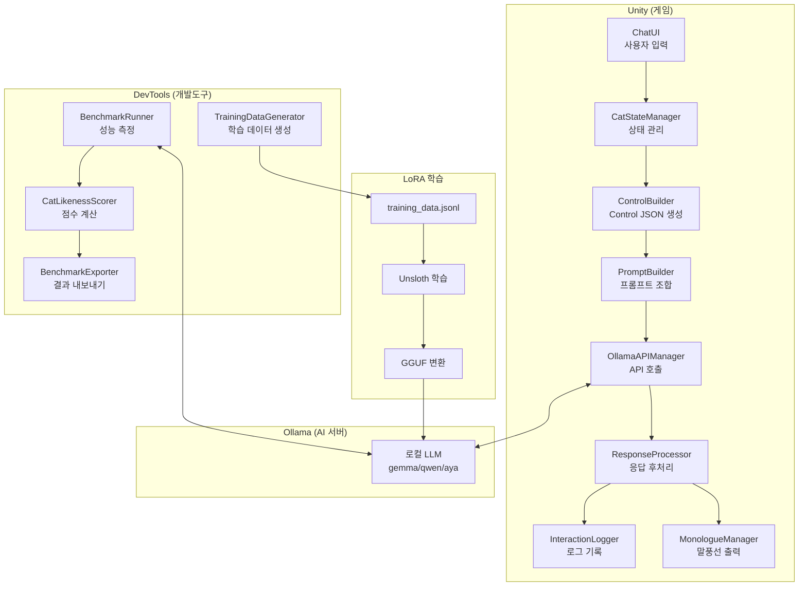

---

## 2. 대화 플로우

사용자가 "안녕?"이라고 입력했을 때의 전체 흐름:

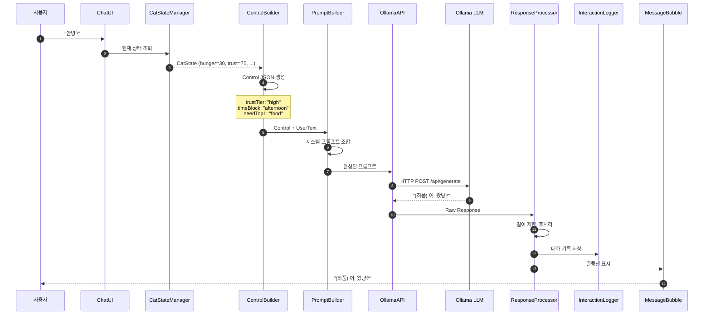

---

## 3. Control 생성 과정

CatState에서 Control JSON으로 변환하는 과정:

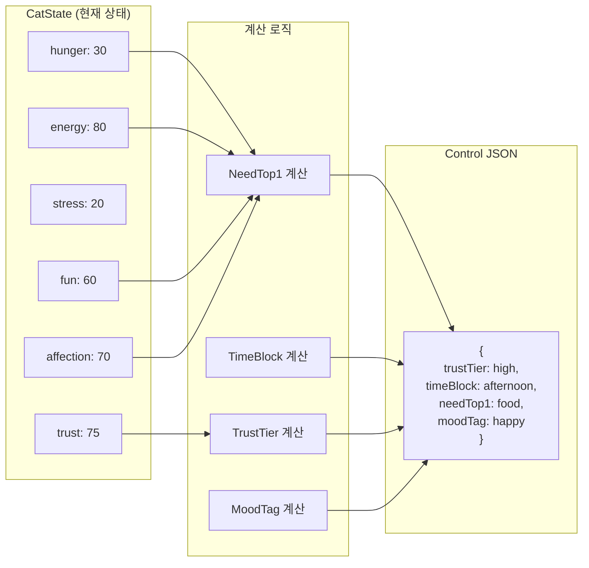

### NeedTop1 결정 로직

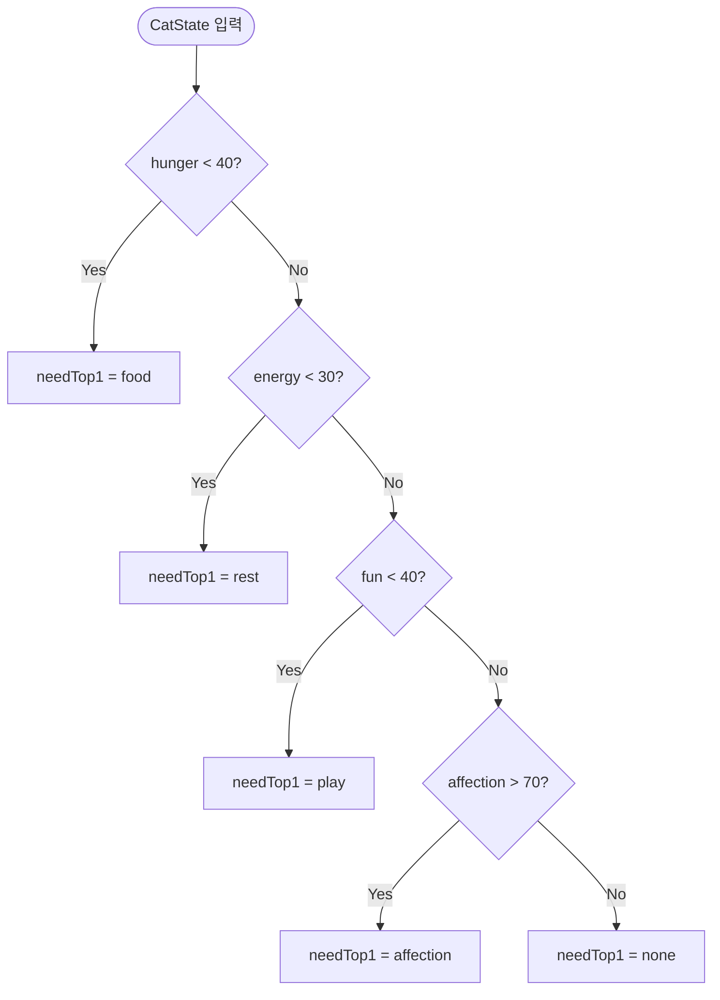

### TrustTier 결정 로직

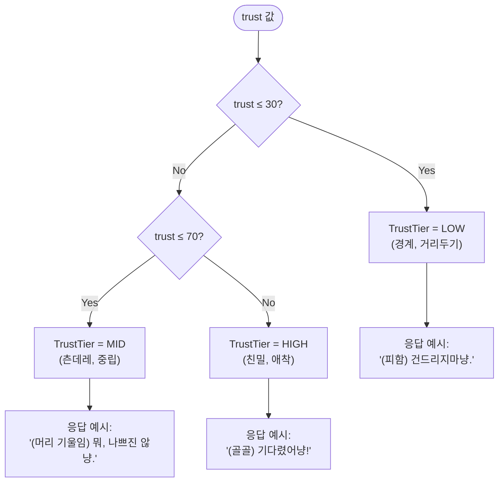

---

## 4. TrustTier별 응답 분기

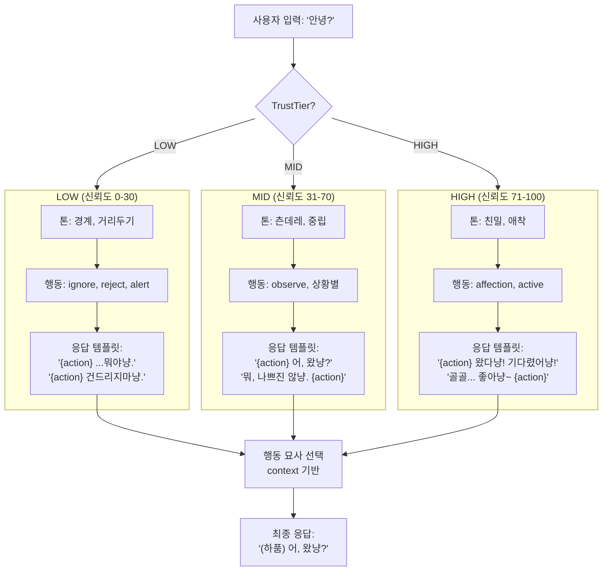

---

## 5. 벤치마크 평가 플로우

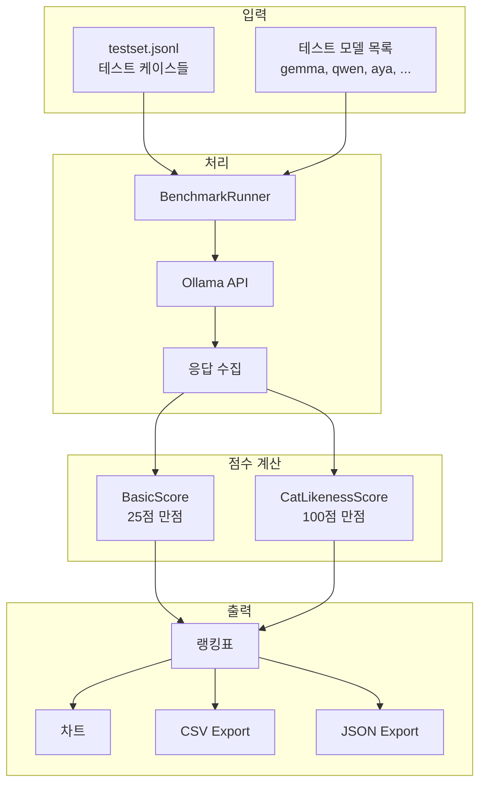

### CatLikenessScore 세부 구성

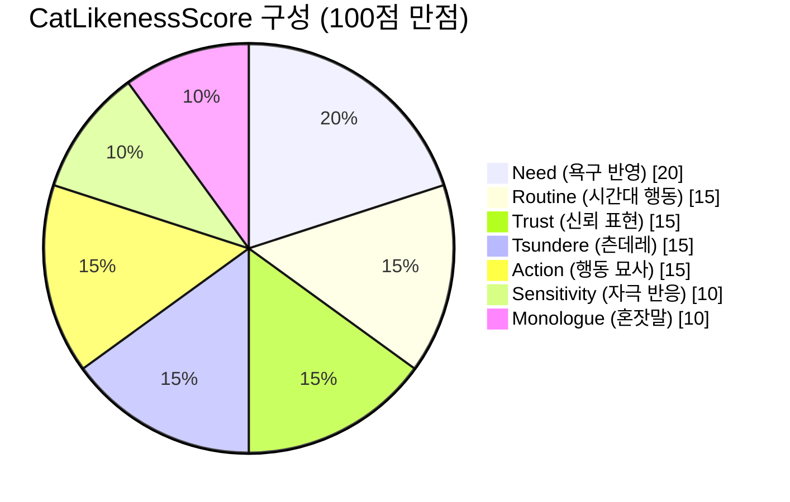

### 점수 계산 상세

```mermaid
flowchart LR
    Response[AI 응답] --> Analyze[키워드 분석]

    Analyze --> R[Routine<br/>우다다/졸림/기지개]
    Analyze --> N[Need<br/>배고파/놀자/쉬고싶어]
    Analyze --> T[Trust<br/>거리두기/친밀 표현]
    Analyze --> TS[Tsundere<br/>흥/어쩔수없이/뭐]
    Analyze --> S[Sensitivity<br/>예민/놀람/반응]
    Analyze --> M[Monologue<br/>...냥/혼잣말]
    Analyze --> A[Action<br/>(하품)/(골골)/(우다다)]

    R --> Sum[총점 합산]
    N --> Sum
    T --> Sum
    TS --> Sum
    S --> Sum
    M --> Sum
    A --> Sum

    Sum --> Final[CatLikenessScore<br/>0-100점]
```

---

## 6. 학습 데이터 생성 플로우

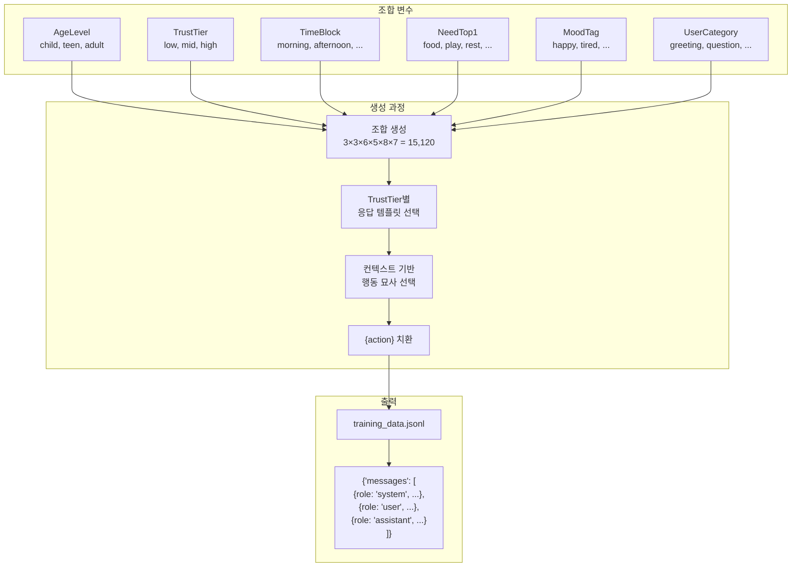

### 행동 묘사 선택 로직

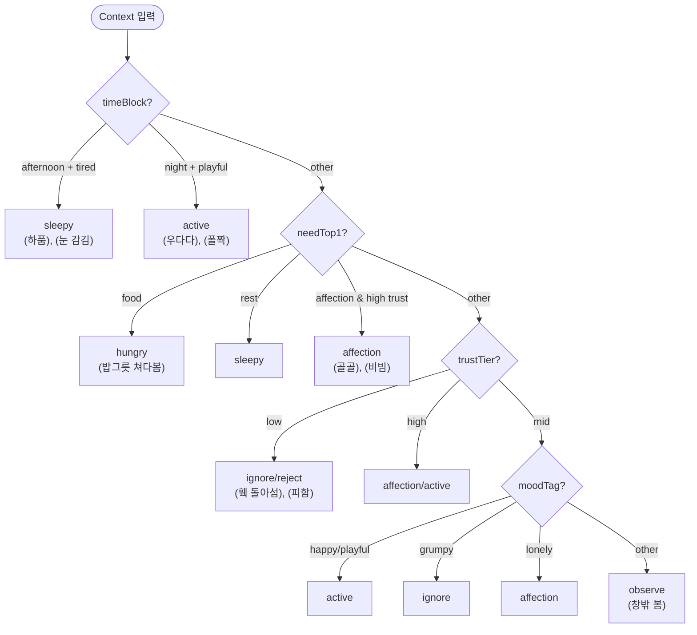

---

## 7. LoRA 학습 파이프라인

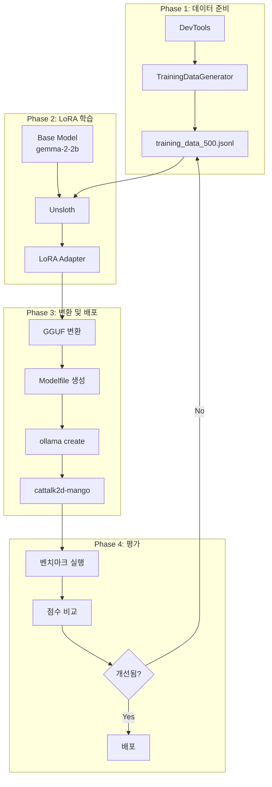

### 학습 파라미터

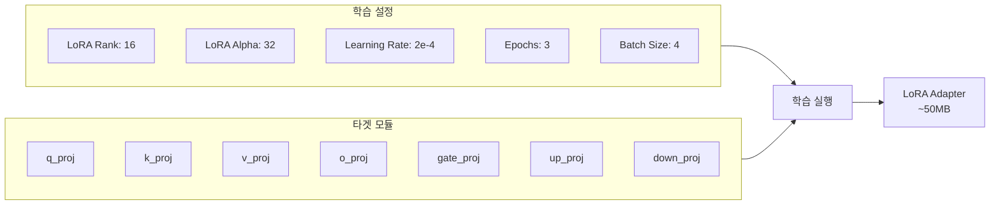

---

## 8. 용어 정리

### 핵심 개념

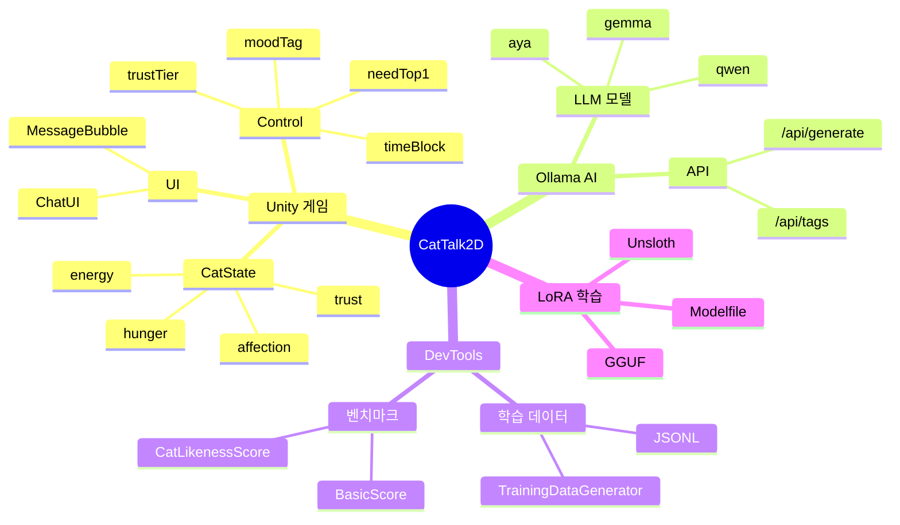

### TrustTier 요약

| TrustTier | 신뢰도 범위 | 톤 | 대표 행동 | 응답 예시 |
|-----------|------------|-----|----------|----------|
| **LOW** | 0-30 | 경계, 거리두기 | ignore, reject | "(피함) 건드리지마냥." |
| **MID** | 31-70 | 츤데레, 중립 | observe, 상황별 | "(머리 기울임) 뭐, 나쁘진 않냥." |
| **HIGH** | 71-100 | 친밀, 애착 | affection, active | "(골골) 기다렸어냥!" |

### CatLikenessScore 영역

| 영역 | 배점 | 측정 내용 | 키워드 예시 |
|------|------|----------|------------|
| **Routine** | 15점 | 시간대별 행동 일관성 | 우다다, 졸림, 기지개 |
| **Need** | 20점 | 욕구 우선순위 반영 | 배고파, 놀자, 쉬고싶어 |
| **Trust** | 15점 | 신뢰도에 따른 표현 | 거리두기, 다가가기 |
| **Tsundere** | 15점 | 츤데레/독립성 | 흥, 어쩔수없이, 뭐 |
| **Sensitivity** | 10점 | 자극 반응 | 깜짝, 뭐야, 놀람 |
| **Monologue** | 10점 | 혼잣말/관찰 | ...냥, 음, 글쎄 |
| **Action** | 15점 | 행동 묘사 | (하품), (골골), (우다다) |

### 행동 묘사 카테고리

| 카테고리 | 행동 예시 | 사용 상황 |
|----------|----------|----------|
| **sleepy** | (하품), (눈 감김), (늘어짐) | afternoon, tired, rest |
| **active** | (우다다), (폴짝), (질주) | night, playful, happy |
| **ignore** | (훽 돌아섬), (외면) | low trust, grumpy |
| **affection** | (골골), (그르릉), (비빔) | high trust, affection |
| **hungry** | (밥그릇 쳐다봄), (냥냥 울음) | food need |
| **observe** | (창밖 봄), (머리 기울임) | bored, neutral |
| **reject** | (피함), (하악) | low trust, discomfort |

---

## 파일 구조

```
CatTalk2D/
├── Assets/_Project/Scripts/
│   ├── AI/               # ControlBuilder, PromptBuilder, ResponseProcessor
│   ├── API/              # OllamaAPIManager
│   ├── Managers/         # CatStateManager, InteractionLogger, MonologueManager
│   └── UI/               # ChatUI, MessageBubble
│
├── Tools/CatDevTools/
│   ├── Services/         # BenchmarkRunner, TrainingDataGenerator
│   │   └── Scoring/      # CatLikenessScorer
│   └── ViewModels/       # MainViewModel
│
├── LoraData/
│   ├── action_templates.json
│   ├── train_lora.py
│   └── requirements.txt
│
└── docs/
    └── ARCHITECTURE.md   # 이 문서
```
